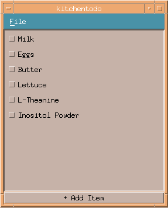

## kitchentodo

Kitchentodo is a simple todo list program written in C using the Motif windowing toolkit. 



### Building
Kitchentodo uses Cmake:
```
mkdir build
cd build
cmake ..
make
```

### Dependencies
Motif, libX11

